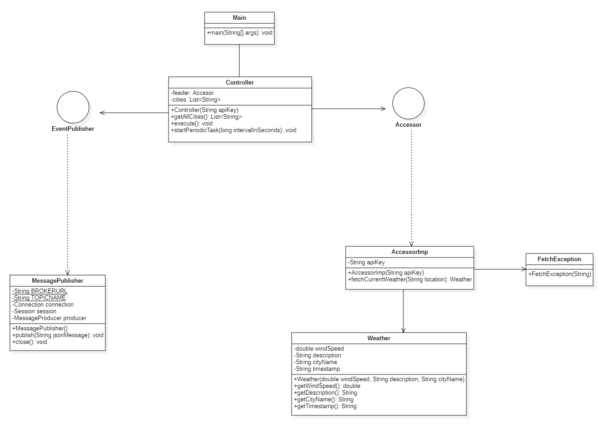
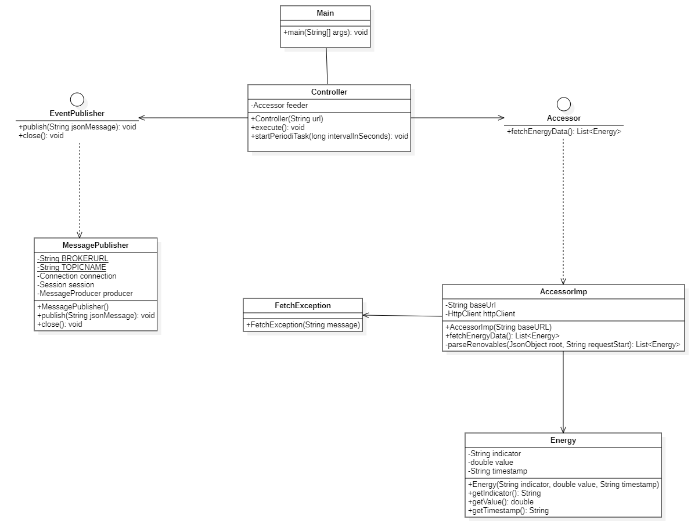
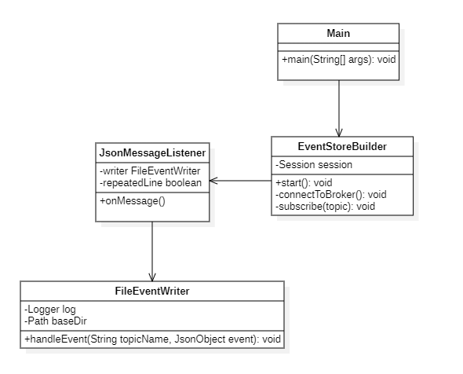
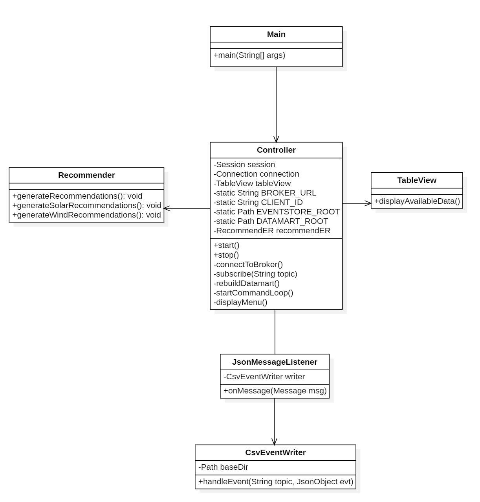
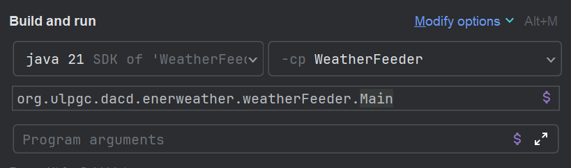

# 🌤️ Enerweather

Enerweather is a Java-based application that analyzes the relationship between weather conditions and renewable energy production across major Spanish cities. It integrates real-time and historical data and presents actionable insights through an interactive CLI.

---

## Project Goal

To analyze the relationship between weather (cloudiness and wind speed) and renewable energy production (solar and wind) in major Spanish cities by combining real-time and historical data sources.

---

## System Architecture

The architecture follows clean modular principles and is inspired by the Lambda pattern.
It consists of the following modules:

### WeatherFeeder
- Fetches current weather for 29 Spanish cities via OpenWeatherMap API.
- Extracts `windSpeed`, `description`, `cityName`.
- Publishes to `weather` topic on ActiveMQ.

### EnergyFeeder

- Connects to REE API.
- Captures `solarEnergy` and `windEnergy`.
- Publishes to `energy` topic.

### EventStoreBuilder

- Subscribes to both `weather` and `energy`.
- Saves events as JSON lines in `.events` files:

eventstore/{topic}/{source}/{YYYYMMDD}.events


### BusinessUnit

- Subscribes to real-time and reads from `eventstore/`.
- Builds a CSV-based datamart organized by date and type.
- Includes a CLI with options to:
  - View stored data by date/type.
  - Rebuild the entire datamart from events.
  - Generate recommendations for top cities in solar or wind energy.
  - Quit application.


---

## Class Diagrams

### WeatherFeeder


### EnergyFeeder


### EventStoreBuilder


### BusinessUnit


---

## Technologies Used

* Java 21
* Apache ActiveMQ
* Maven
* Gson (JSON)

---

## 🚀 Getting Started

### Prerequisites

* Java 21
* Apache ActiveMQ (tcp://localhost:61616)
* Maven

### Setup
1. Clone the project:
```bash
git clone https://github.com/enerweather/enerweather.git
```
2. Build the project:
```bash
cd Enerweather
mvn clean install 
```
### Install and Run Activemq
1. Download Apache ActiveMQ from https://activemq.apache.org/
2. Extract it and run this from the ActiveMQ installation directory:
```bash
./bin/activemq start
```
3. Verify it's running by accessing the web console at http://localhost:8161/admin/ (login: admin / admin).

### Run modules
Run each individual module, first EventStoreBuilder, then both feeders, and finally the BusinessUnit.

For WeatherFeeder, the API key of OpenWeatherMap is needed, and the free one that is given upon registration is enough.




So to run the WeatherFeeder module, create a run configuration with the previous parameters in the icon next to the run button, and putting the OpenWeatherMap API in the Program arguments section.

### Interact with the console
Once inside the BusinessUnit module, use the interactive CLI:
1. View Data
  - Choose between weather or energy.
  - Select a date.
  - Filter and browse the corresponding dataset.
2. Recommendations
  - View top 3 cities by solar or wind energy levels.
3. Quit
  - Exit the application.


---

## Design Principles

* Modular architecture – Each module is independent and focused on a single responsibility.
* Event-driven – Modules communicate via ActiveMQ topics.
* Hexagonal architecture – Use of ports and adapters.
* Historical replay – Events can be replayed from .events files to rebuild the datamart.

---

## Sample Event Structure

### Weather

```json
{
  "timestamp": "2025-05-18T13:00:00Z",
  "cityName": "Madrid",
  "description": "overcast clouds",
  "windSpeed": 4.2
}
```

### Energy

```json
{
  "timestamp": "2025-05-18T13:00:00Z",
  "indicator": "solarEnergy",
  "value": 2300.5
}
```

---

## 📄 Authors

* **Leonoor Antje Barton**
* **Joel Ojeda Santana**


---
